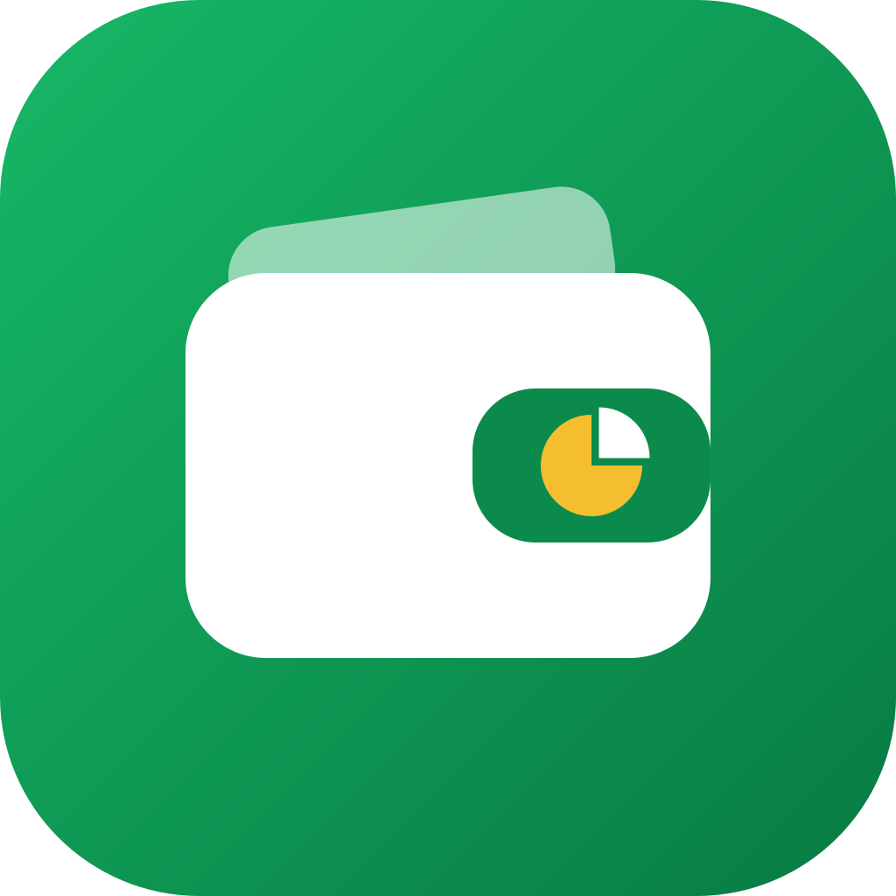
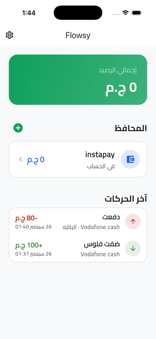

<p align="center">
  
</p>

# Flowsy — Wallet Split

Flowsy tracks the money in each of your e-wallets, such as Vodafone Cash or InstaPay, and what you plan to spend it on. For every wallet it answers one question: after what I'm planning to pay, how much do I actually have left?

The app is in Arabic and English, with right-to-left layout and light and dark themes.

## Demo

<p align="center">
  
</p>

### Example

Say you keep notes like these:

> **Vodafone Cash**: 100 in account. I will spend 20 on one thing and 20 on another, so I have 60.
>
> **InstaPay**: 810 in account. I will spend 800 on internet and bundles, so I have 10.

In Flowsy each wallet shows the same calculation:

```
Vodafone Cash                 InstaPay
In account        100         In account        810
I will spend     - 40         I will spend    - 800
─────────────────────         ─────────────────────
So I have          60         So I have          10
```

1. **Add a wallet** from the home screen, for example "Vodafone Cash".
2. **Add money** to record what is in the account.
3. **Add planned spending** under "I will spend on", with a label and an amount.
4. **Record a payment** with "I paid" when you actually pay. If you pick the planned item it was for, both the balance and that item go down.

"So I have" turns red if you plan to spend more than you have. Every top-up and payment is kept in the wallet's history and in the home screen's recent activity.

## Features

- Multiple wallets with a live balance and a total across all wallets
- Six quick colours per wallet, or any colour from a palette or colour wheel
- Planned spending per wallet, with the leftover amount calculated automatically
- Top-ups and payments saved atomically with Firestore transactions, so a payment can never take a balance below zero
- Amounts can be typed with Arabic (١٢٣) or Western (123) digits
- Email sign-in with a "Forgot password?" reset email, and each user's data kept private by Firestore security rules
- Optional app lock with fingerprint, Face ID or the phone's PIN. It locks on launch and after 30 seconds in the background
- Arabic and English, right-to-left support, and light, dark or system theme

## Tech stack

| Area | Choice |
|---|---|
| Framework | Flutter 3.44, Dart 3.12 |
| Architecture | Feature-first clean architecture: data, domain, repository, presentation |
| State management | Cubit, from flutter_bloc |
| Errors | dartz `Either` with typed, localised failures |
| Backend | Firebase Auth and Cloud Firestore |
| Localisation | easy_localization |
| Dependency injection | get_it |
| App lock | local_auth |
| Colour picker | flex_color_picker |

### Data layout

```
users/{uid}/wallets/{walletId}
users/{uid}/wallets/{walletId}/allocations/{allocationId}   planned spending
users/{uid}/transactions/{transactionId}                     top-ups and payments
```

## Getting started

### 1. Firebase

The app needs a Firebase project with **Authentication** (email and password) and **Cloud Firestore** turned on.

```bash
flutterfire configure            # writes lib/firebase_options.dart and the platform config files
firebase deploy --only firestore # uploads firestore.rules and firestore.indexes.json
```

If you'd rather use the Firebase console than the CLI:

- Paste the contents of `firestore.rules` into **Firestore → Rules** and publish.
- Add a composite index in **Firestore → Indexes** on the `transactions` collection with `walletId` ascending and `createdAt` descending. The wallet history needs it.

### 2. Run

```bash
flutter pub get
flutter run
```

### 3. Test

```bash
flutter test
```

The tests cover the "So I have" calculation, parsing of Arabic-digit amounts, the app lock rules, password reset, and a widget test that makes sure saving a top-up closes only the form and not the screens under it.

### 4. Build an Android release

```bash
flutter build apk --release
```

The APK is written to `build/app/outputs/flutter-apk/app-release.apk`.

> The release build is currently signed with the debug key. That is fine for installing and sharing test builds. Before publishing to Google Play, set up a release keystore and change `applicationId` in `android/app/build.gradle.kts` from `com.example.wallet_split`.

## Project structure

```
lib/
├── core/            theme, routing, dependency injection, errors, helpers, animations
└── features/
    ├── app_lock/    fingerprint, face and PIN lock
    ├── auth/        sign up, sign in and password reset
    ├── intro/       splash screen
    ├── settings/    language, theme and sign out
    └── wallets/     wallets, planned spending, top-ups and payments
```
