<p align="center">
  
</p>

<p align="center">
  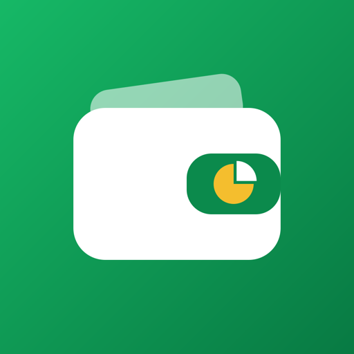
</p>

<h1 align="center">Flowsy</h1>

<p align="center">
  <b>Every pound, in its place.</b><br>
  A bilingual (Arabic and English) budgeting app that splits your money into wallets, lets you plan your spending, and shows what is really left.
</p>

<p align="center">
  
  
  
  
</p>

---

Flowsy tracks the money in each of your wallets, such as InstaPay, Vodafone Cash, a bank card or cash at home, and what you plan to spend it on. For every wallet it answers one question: after what I'm planning to pay, how much do I actually have left?

## Screenshots

<p align="center">
  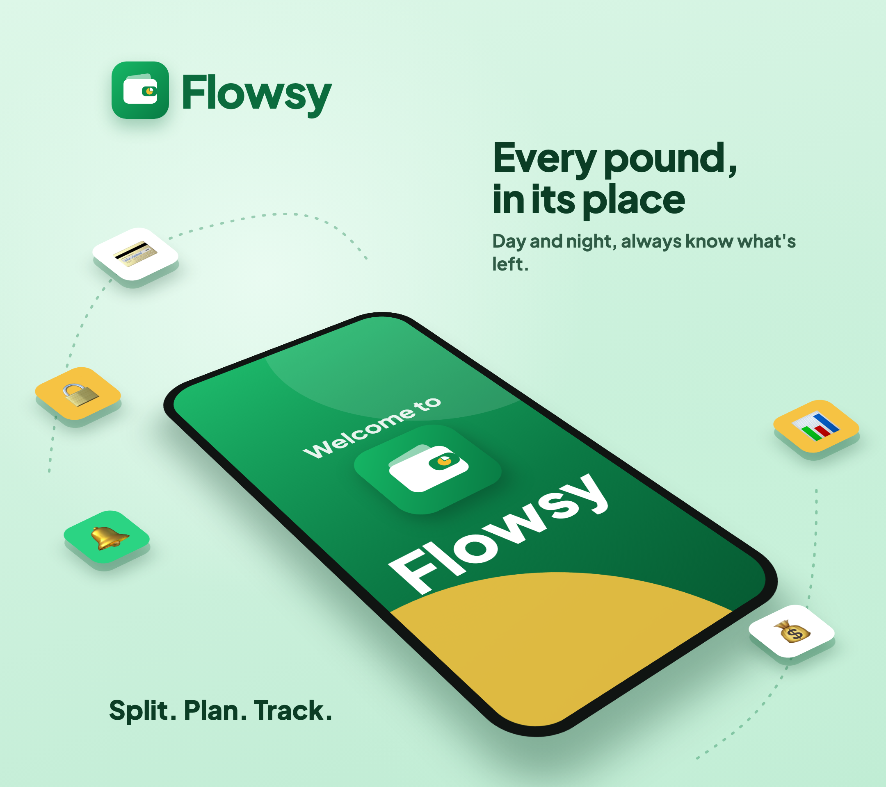
</p>

<p align="center">
  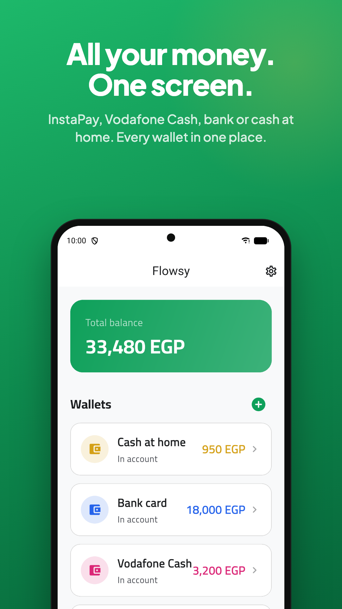
  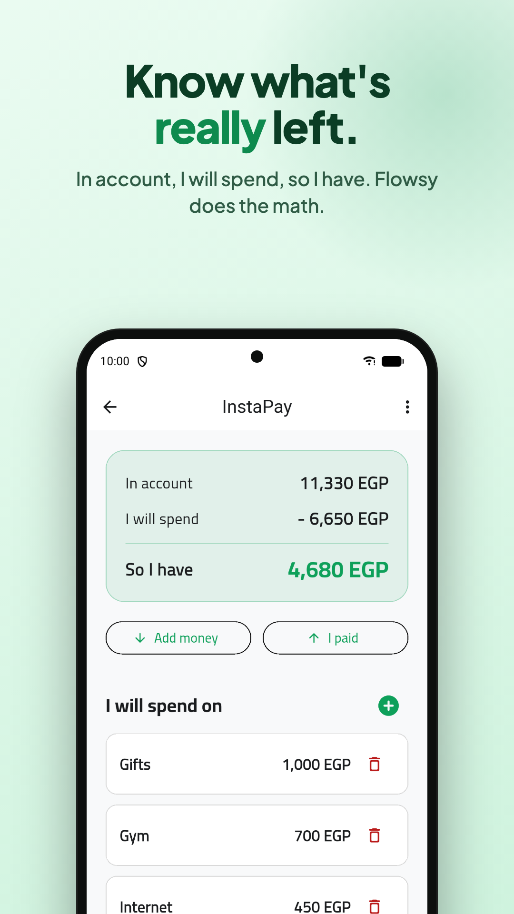
  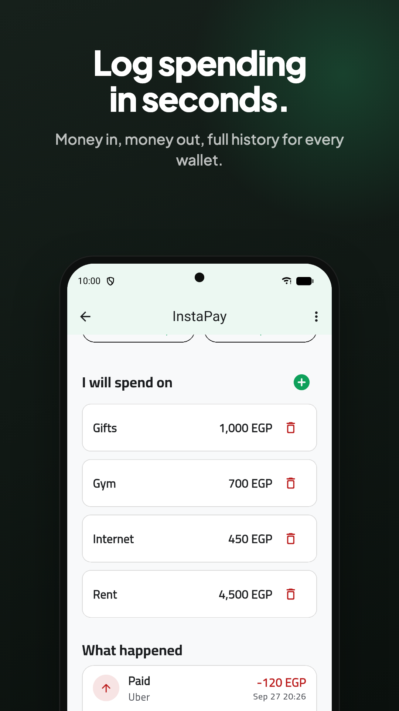
  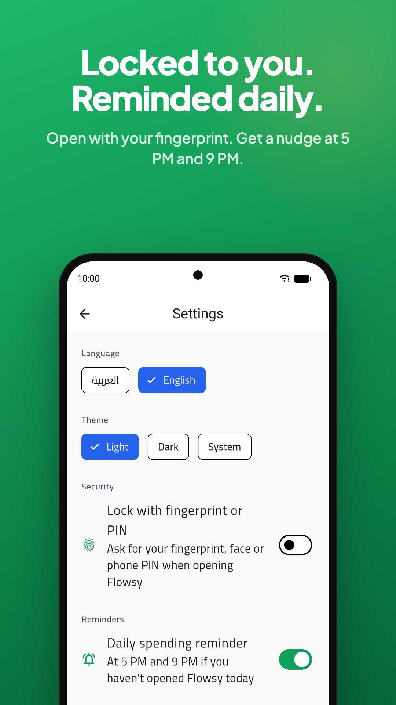
  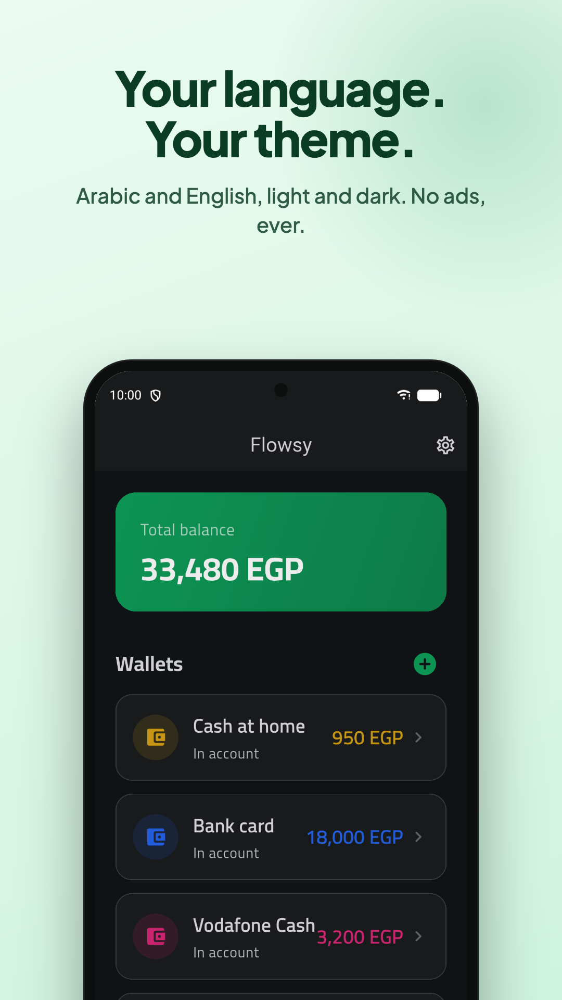
</p>

<details>
<summary><b>Arabic screenshots (right-to-left)</b></summary>
<br>
<p align="center">
  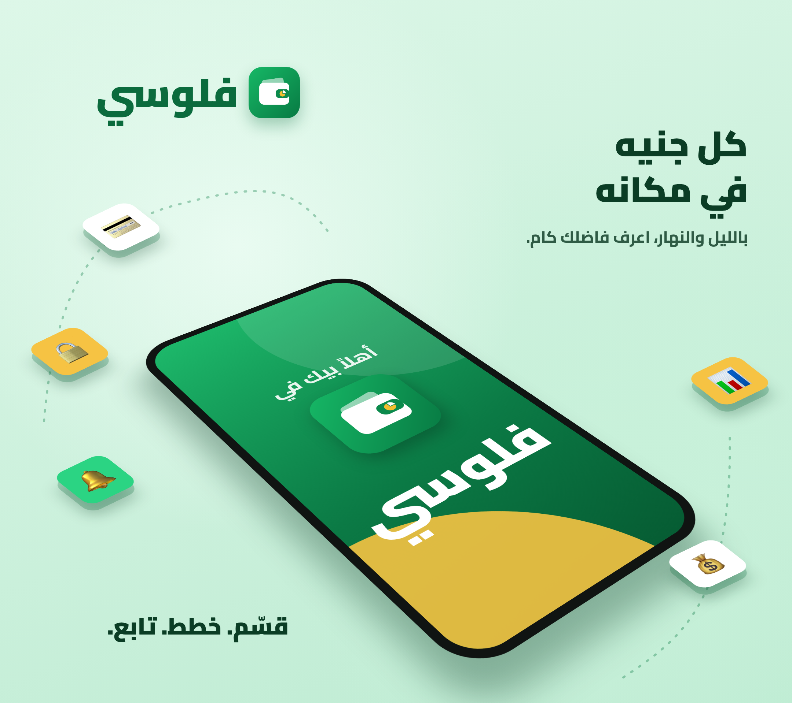
</p>
<p align="center">
  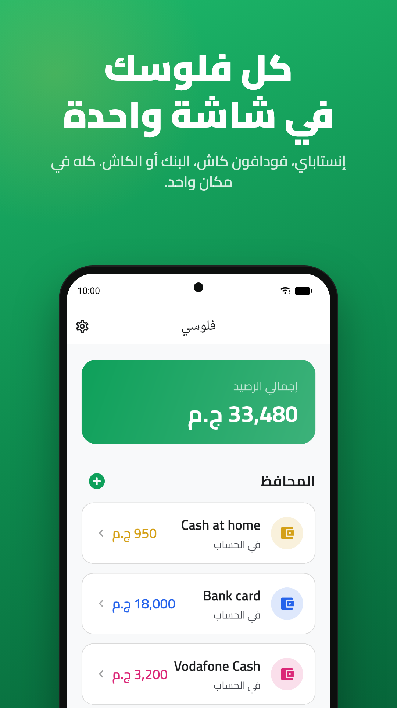
  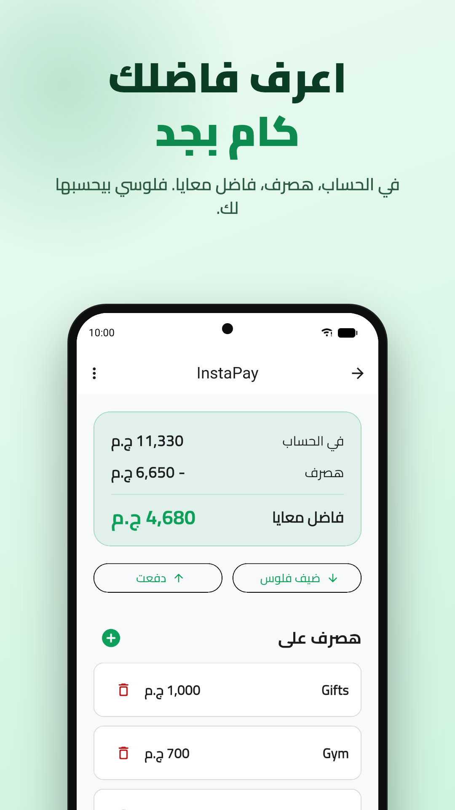
  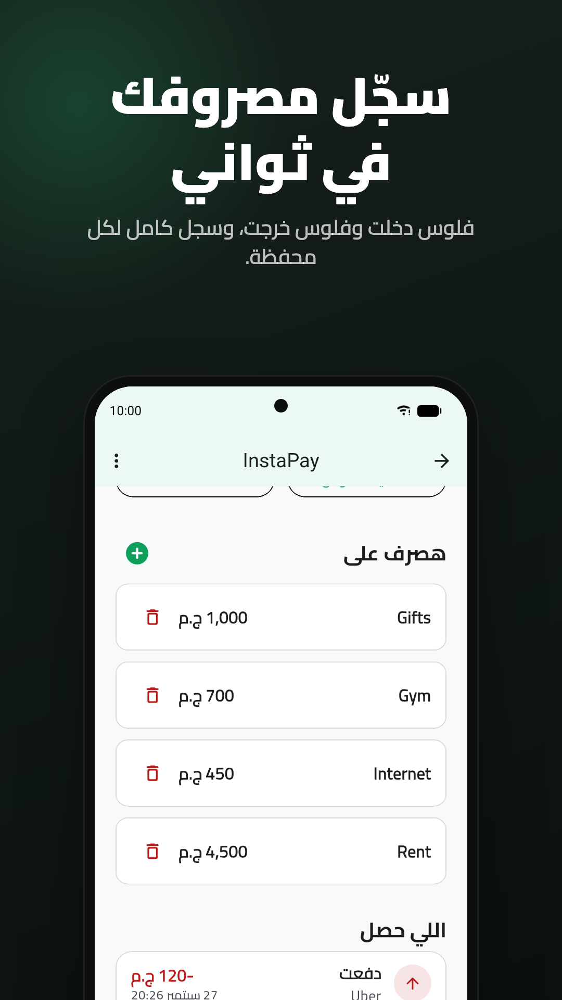
  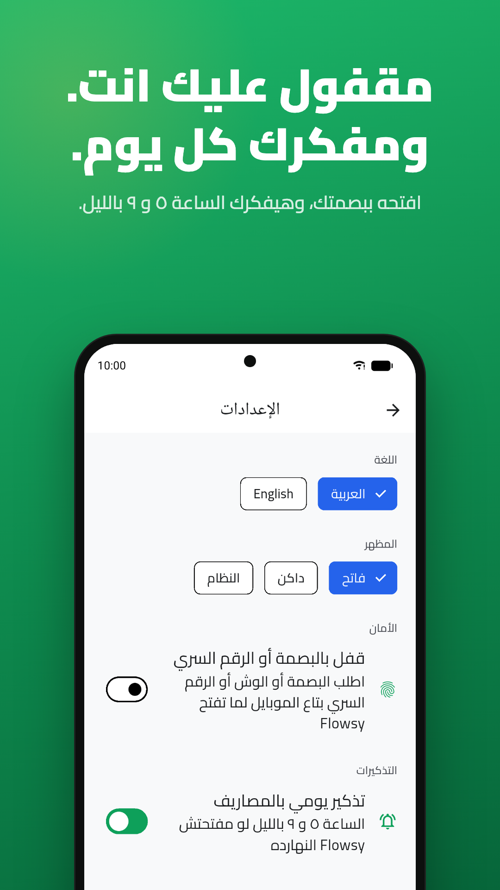
  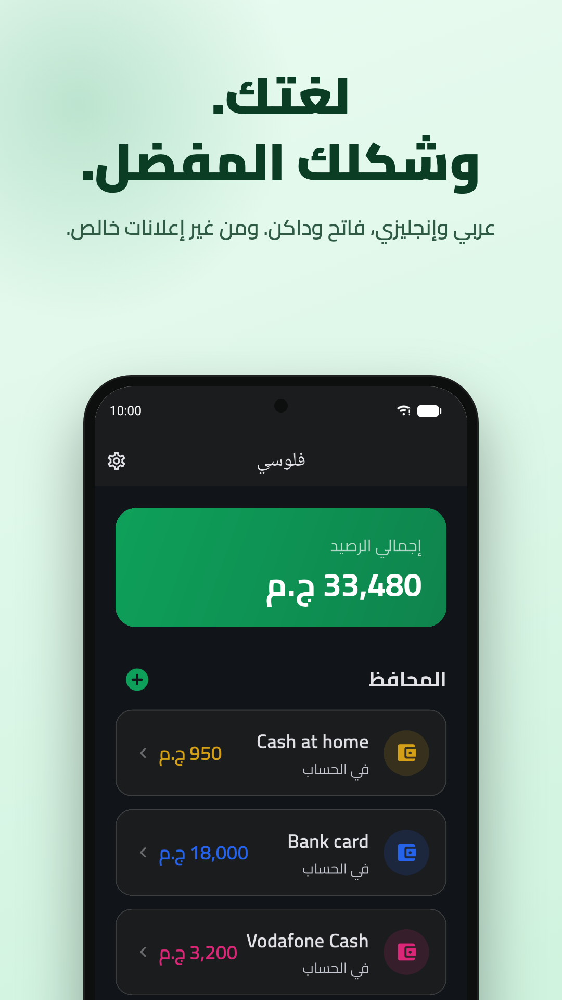
</p>
</details>

<details>
<summary><b>Tablet screenshots</b></summary>
<br>
<p align="center">
  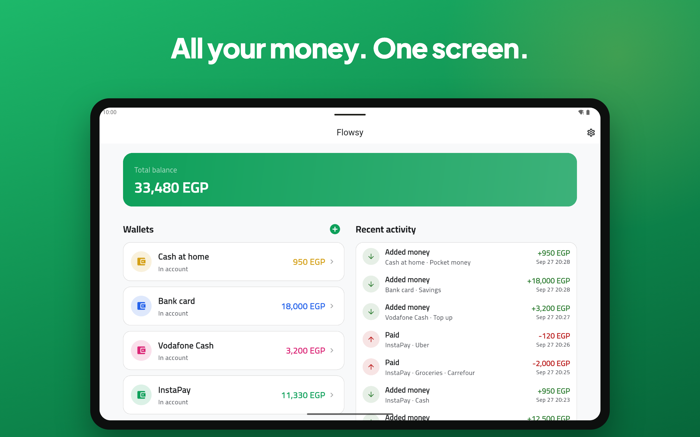
  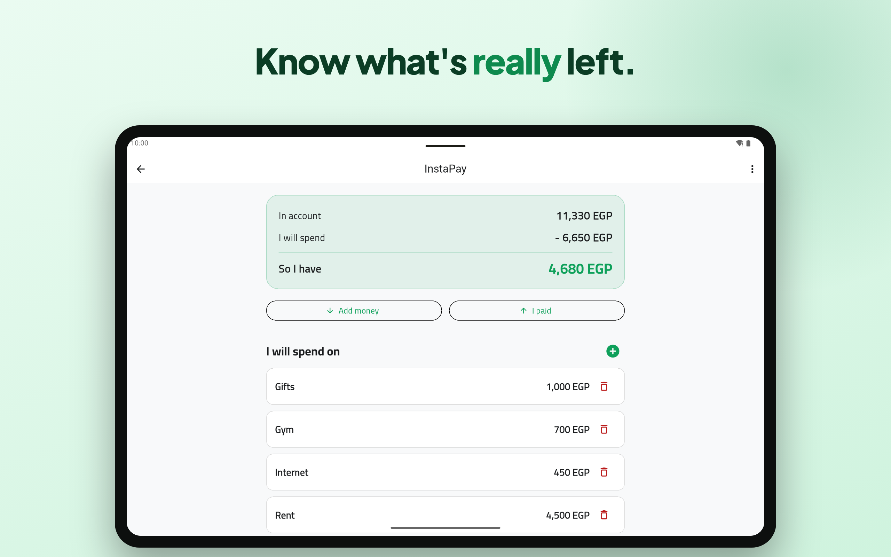
</p>
</details>

## Demo video

<p align="center">
  <a href="https://youtu.be/ahtd_oN3bZ4">
    
  </a>
  <br>
  <a href="https://youtu.be/ahtd_oN3bZ4">▶ Watch the demo on YouTube</a>
</p>

## How it works

Say you keep notes like these:

> **Vodafone Cash**: 100 in account. I will spend 20 on one thing and 20 on another, so I have 60.
>
> **InstaPay**: 810 in account. I will spend 800 on internet and bundles, so I have 10.

In Flowsy each wallet shows the same calculation:

```
Vodafone Cash                 InstaPay
In account        100         In account        810
I will spend     - 40         I will spend    - 800
─────────────────────         ─────────────────────
So I have          60         So I have          10
```

1. **Add a wallet** from the home screen, for example "Vodafone Cash".
2. **Add money** to record what is in the account.
3. **Add planned spending** under "I will spend on", with a label and an amount.
4. **Record a payment** with "I paid". If you pick the planned item it was for, both the balance and that item go down.

"So I have" turns red if you plan to spend more than you have. Every top-up and payment is kept in the wallet's history and in the home screen's recent activity.

## Features

- **Wallets:** multiple wallets with a live balance and a total across all of them. Each wallet gets a name and a colour from six presets or a full colour picker.
- **Planned spending:** list what each wallet will cover this month, and the leftover amount is calculated for you.
- **Safe transactions:** top-ups and payments are saved atomically with Firestore transactions, so a payment can never take a balance below zero.
- **Arabic digits:** amounts can be typed with Arabic (١٢٣) or Western (123) digits.
- **Accounts:** email sign-in, a "Forgot password?" reset email, and data kept private per user by Firestore security rules.
- **Delete account:** users can erase their account and all their data from Settings.
- **App lock:** optional fingerprint, Face ID or phone PIN lock. It locks on launch and after 30 seconds in the background.
- **Daily reminders:** a nudge at 5 PM and 9 PM to log spending, only on days the app was not opened.
- **Made for everyone:** Arabic and English with full right-to-left support, light, dark or system theme, and layouts for phones and tablets.
- **Private:** no ads and no tracking.

## Tech stack

| Area | Choice |
|---|---|
| Framework | Flutter 3.44, Dart 3.12 |
| Architecture | Feature-first clean architecture: data, domain, repository, presentation |
| State management | Cubit, from flutter_bloc |
| Errors | dartz `Either` with typed, localised failures |
| Backend | Firebase Auth and Cloud Firestore |
| Localisation | easy_localization |
| Dependency injection | get_it |
| Responsive UI | flutter_screenutil with a capped scale for tablets |
| App lock | local_auth |
| Reminders | flutter_local_notifications and timezone |
| Animations | flutter_animate |
| Colour picker | flex_color_picker |

### Data layout

```
users/{uid}/wallets/{walletId}
users/{uid}/wallets/{walletId}/allocations/{allocationId}   planned spending
users/{uid}/transactions/{transactionId}                     top-ups and payments
```

## Getting started

### 1. Firebase

The app needs a Firebase project with **Authentication** (email and password) and **Cloud Firestore** turned on.

```bash
flutterfire configure            # writes lib/firebase_options.dart and the platform config files
firebase deploy --only firestore # uploads firestore.rules and firestore.indexes.json
```

If you'd rather use the Firebase console than the CLI:

- Paste the contents of `firestore.rules` into **Firestore → Rules** and publish.
- Add a composite index in **Firestore → Indexes** on the `transactions` collection with `walletId` ascending and `createdAt` descending. The wallet history needs it.

### 2. Run

```bash
flutter pub get
flutter run
```

### 3. Test

```bash
flutter test
```

The tests cover the "So I have" calculation, parsing of Arabic-digit amounts, the app lock rules, reminder scheduling, password reset, and a widget test that makes sure saving a top-up closes only the form and not the screens under it.

### 4. Build for Google Play

Put your upload keystore details in `android/key.properties`, then build the signed bundle:

```bash
flutter build appbundle --release
```

The bundle is written to `build/app/outputs/bundle/release/app-release.aab`. Raise `version:` in `pubspec.yaml` before every upload. Without `key.properties`, release builds fall back to the debug key so `flutter run --release` still works.

The full publishing checklist, including the store listing, data safety answers and privacy pages, is in [store/PLAY_STORE_GUIDE.md](store/PLAY_STORE_GUIDE.md).

## Project structure

```
lib/
├── core/            theme, routing, dependency injection, errors, helpers, reminders, animations
└── features/
    ├── app_lock/    fingerprint, face and PIN lock
    ├── auth/        sign up, sign in, password reset and account deletion
    ├── intro/       splash screen
    ├── settings/    language, theme, app lock, reminders and sign out
    └── wallets/     wallets, planned spending, top-ups and payments

store/
├── graphics/        app icon and feature graphic
├── listing/         Play Store listing text in English and Arabic
├── screenshots/     phone and tablet screenshots in both languages
├── tools/           scripts that generate the store graphics and demo video
└── video/           promo demo video
```
